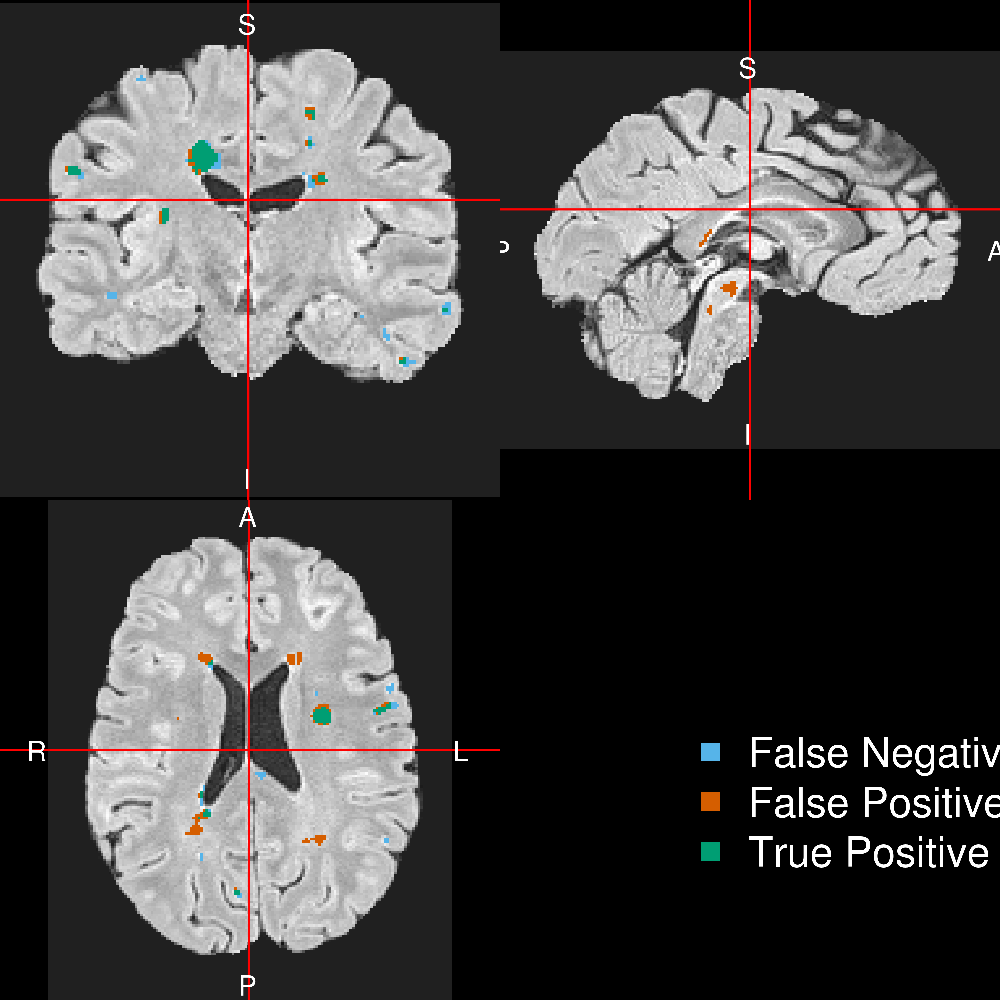

```{r opts, include = FALSE}
library(knitr)
library(knitcitations)
library(dplyr)
library(tableone)
library(broom)
cite_options(max.names = 1)
opts_chunk$set(echo = FALSE, prompt = FALSE, message = FALSE, warning = FALSE, comment = "", results = 'hide')
```


```{r result, prompt=TRUE, echo=FALSE, message=FALSE, warning=FALSE}
results = readr::read_rds("seg_reslts.rds")
df = results %>% 
  select(id, group, volume, smooth) %>% 
  distinct() %>% 
  arrange(id)
group_df = df
pick_examples = results %>% 
  filter(group == "test", run_model == "RF, no T1Post") %>% 
  mutate(dice_order = order(dice))
ind = floor( nrow(pick_examples)/2)
id = pick_examples[ ind, ]
overall = readr::read_rds("overall_seg_reslts.rds")
```

```{r setup, prompt=TRUE, echo=FALSE, message=FALSE, warning=FALSE}
load("cs_demog.rda")
cs = cs_demog
cs = cs %>% 
  mutate(type = recode(ms_type,
    "CIS" = "Clinically Isolated Syndrome",
    "RR" = "Relapsing-remitting", 
    SP = "Secondary-progressive", 
    PP = "Primary-progressive",
    PR = "Progressive-relapsing")
  )
cs$type[ is.na(cs$type)] = "Unspecified"
## Vector of variables to summarize
conVars <- c("Age", "EDSS", "Lesion_Volume")
## Vector of categorical variables that need transformation
catVars <- c("sex", "MS_Subtype")
cs$MS_Subtype = factor(cs$type)
cs$Sex = factor(cs$sex)
cs = left_join(cs, df)
cs = cs %>% 
  dplyr::rename(EDSS = edss,
         Age = age,
         Lesion_Volume = volume)
```


```{r}
## Create a TableOne object
demog_tab <- CreateTableOne(
  vars = c("Age", "sex", "EDSS", "Lesion_Volume", "MS_Subtype"), 
  data = cs, factorVars = catVars)
tabAsStringMatrix <- print(demog_tab, printToggle = FALSE, noSpaces = TRUE)
tabAsStringMatrix = as.data.frame(tabAsStringMatrix, stringsAsFactors = FALSE)
tabAsStringMatrix = tibble::rownames_to_column(tabAsStringMatrix, var = "Variable")

demog_tab_by_group = CreateTableOne(
  strata = "group",
  vars = c(conVars, catVars), 
  data = cs, factorVars = catVars, test = FALSE)
```


## Overview of Work/Research

<div style='font-size: 28pt;'>
- Segmentation/Classification of:
    - White Matter Lesions in Multiple Sclerosis
    - Brain vs. Skull (CT)
    - Brain Hemorrhage/Stroke (CT) 
- R Package Development/"Data Science"
- Neuroimaging and R (Neuroconductor Project)
</div>

## Overview of Work/Research

<div style='font-size: 28pt;'>
- Segmentation/Classification of:
    - **White Matter Lesions in Multiple Sclerosis**
    - Brain vs. Skull (CT)
    - Brain Hemorrhage/Stroke (CT) 
- R Package Development
- **Neuroimaging and R (Neuroconductor Project)**
</div>


# Brain Image Processing in R

----
<div class="container"> 
<div id="left_col2"> 
  <h2>Workflow for an Analysis</h2>
<div style='font-size: 32pt;'>

- bash  
- FSL  
- ANTs  
- MRIcroGL  
- OsiriX  
- SPM 12  

</div>
  </div>    
  <div id="right_col2">

  </div>
</div>


----
<div class="container"> 
<div id="left_col2"> 
  <h2>Workflow for an Analysis</h2>
<div style='font-size: 32pt;'>
  
Multiple pieces of software used

  - all different syntax
</div>
  </div>    
  <div id="right_col2">

  </div>
</div>


----
<div class="container"> 
<div id="left_col2"> 
  <h2>Goal: </h2>
<div style='font-size: 24pt;'>
  
Lower the bar to entry 

- all R code
    - pipeline tool
    - "native" R code

Complete pipeline
  
  - preprocessing and analysis
</div>
  </div>    
  <div id="right_col2">

  </div>
</div>


## Bioinformatics Repository: Bioconductor<br>  

## Bioinformatics Repository: Bioconductor<br>  

- centralized bioinformatics/genomics packages
- large community/number of packages (> 1300)
- published tutorials and workflows 
- additional requirements to CRAN (e.g. packages need vignettes)


# <br> An R Platform for <br> Medical Imaging Analysis


# Lesion Segmentation of MS

## Public Dataset with Lesion Segmentation

* "A novel public MR image dataset of multiple sclerosis patients with lesion segmentations based on multi-rater consensus" [@msdata]
  - Data Published at http://lit.fe.uni-lj.si/tools.php?lang=eng
  - 30 subjects with MRI (3T Siemens Trio)
  - Manually segmented by 3 expert raters 
  - Creative-Commons Attribution (CC-BY)
  
## Demographic Data
- On many different therapies (9 no therapy)

```{r, results = "asis"}
knitr::kable(tabAsStringMatrix)
```


## Imaging Data

* 2D T1 (TR=2000ms, TE=20ms, TI=800ms) and after gadolinium
* 2D T2 (TR=6000ms, TE=120ms), 3D FLAIR (TR=5000ms, TE=392ms, TI=1800 ms)
    - Fluid attenuated inversion recovery - reduce signal of fluids
- All had flip angle of 120$^{\circ}$

</div>
<div>

</div>


<!-- The obtained median DSC values were 0.85 and 0.82 for -->
<!-- intra- and inter-rater variability using manual tools, while -->
<!-- the respective values obtained with the semi-automated -->
<!-- tools were 0.92 and 0.89. -->


## Terminology: Neuroimaging to Data/Statistics

<div style="font-size: 26pt">
* Segmentation ⇔ classification 
* Image ⇔ 3-dimensional array
* Mask/Region of Interest ⇔ binary (0/1) image 
* Registration ⇔  Spatial Normalization/Standarization
    - "Lining up" Brains
</div>


## Image Representation: voxels (3D pixels)
<div id="left_col2"> 

</div>
</div>    
<div id="right_col2">

<p style='font-size: 10pt;'></p>
</div>

## Step 1: Create Predictors for each Sequence   

## Data Structure for One Patient <br/>   

---

<div class="container"> 
<div id="left_col2"> 
  <h2>Step 2: Aggregate Data</h2>
  Training Data Structure
  
  * Stack together `r sum(df$group== "train")` randomly selected patients, stratified by age (over median) and volume
  * Train model/classifier on this design matrix
  * Test on `r sum(df$group== "test")` hold out
  
  </div>    
  <div id="right_col2">
    
  </div> 
</div>


## Step 3: Fit Models / Classifier

Let $y_{i}(v)$ be the presence / absence of lesion for voxel $v$ from person $i$.  

General model form: 
$$
 P(Y_{i}(v) = 1)  \propto f(X_{i}(v))
$$

## Models Fit on the Training Data

- OASIS logistic regression with images, and the interaction of the image with a 10mm$^3$ and 20mm$^3$ smoother [@oasis].  Does not include T1Post
  - With the original model from the paper and a re-trained model
- Logistic Regression: \(f(X_{i}(v)) = \text{expit} \left\{ \beta_0 + \sum_{k= 1}^{p} x_{i, k}(v)\beta_{k}\right\}  \)
- Random Forests [@ranger], [@breiman2001random]
  - With and without the T1-Post for comparison to OASIS
<div class="centerer">
\(f(X_{i}(v)) \propto\) 

## 

## Dice Results (Triangle is population Dice) 


## RF Predicted Volume Estimates True Volume 

## OASIS: not so much 

## Patient with Median Overlap in Test Set

 

## Patient with Median Overlap in Test Set
 


## R Package

- `smri.process` - on GitHub and Neuroconductor
  - relies on other Neuroconductor (not CRAN) packages
  - 


## Conclusions of Stroke Analyses

<div style="font-size: 24pt">

- We can segment ICH volume from CT scans <br><br>
- We can create population-level ICH distributions <br/><br/>
- Voxel-wise regression can show regions associated with severity <br/><br/>

</div>


## Conclusions of Stroke Analyses

<div style="font-size: 24pt">

- We can segment ICH volume from CT scans
    - **Incorporate variability of estimated volume**
- We can create population-level ICH distributions
    - **Uncertainty measures of this**
- Voxel-wise regression can show regions associated with severity
    - **Validate these regions (MISTIE III)**
    - **Scalar on image regression** 

</div>

# Neuroimaging and R

## Authored R Packages:

<div id="wrap">
<div id="left_col">

- **fslr** <p style='font-size: 12pt;'>(Muschelli, John, et al. "fslr: Connecting the FSL Software with R." R JOURNAL 7.1 (2015): 163-175.)</p>
- brainR <p style='font-size: 12pt;'>(Muschelli, John, Elizabeth Sweeney, and Ciprian Crainiceanu. "brainR: Interactive 3 and 4D Images of High Resolution Neuroimage Data." R JOURNAL 6.1 (2014): 42-48.)</p>
- extrantsr
- ichseg <p style='font-size: 12pt;'>Muschelli, John, et al. "PItcHPERFeCT: Primary intracranial hemorrhage probability estimation using random forests on CT." NeuroImage: Clinical 14 (2017): 379-390.</p>
- dcm2niir
- matlabr
- spm12r


</div>
<div id="right_col">

- itksnapr
- papayar
- WhiteStripe
- oasis
- SuBLIME
- googleCite
- diffr
- rscopus
- glassdoor

</div>
</div>


## Number of Downloads (CRAN packages)

From the `cranlogs` R package:

```{r cranlogs, cache = TRUE, eval = TRUE}
if (!require(cranlogs)) {
  library(devtools)
  install_github("metacran/cranlogs")
}
first_date = "2014-01-10"
today = Sys.Date()
long_today = format(Sys.time(), "%B %d, %Y")
packs = c("brainR", "cifti", "diffr", "fedreporter", "freesurfer", "fslr", 
"gcite", "gifti", "glassdoor", "kirby21.base", "kirby21.fmri", 
"kirby21.t1", "matlabr", "neurobase", "neurohcp", "neurovault", 
"papayar", "rscopus", "spm12r", "stapler", "WhiteStripe")
last_week = cran_downloads( when = "last-week",
                            packages = packs)
last_week = plyr::ddply(last_week, plyr::.(package), summarise, 
                  Last_Week = sum(count))
dl = cran_downloads( from = first_date, to = today,
                     packages = packs)
dl = plyr::ddply(dl, plyr::.(package), summarise, All_Time = sum(count))
dl = merge(dl, last_week)
dl = plyr::arrange(dl, plyr::desc(Last_Week))
colnames(dl) = c("Package", "All Time", "Last Week")
```


```{r dt_library}
library(DT)
```

```{r dt_cranlogs, results = "asis", eval = TRUE, dependson = "cranlogs"}
datatable(dl, filter = "none", selection = "none", rownames = FALSE,
          options = list(dom = 't', autoWidth = TRUE,
                         columnDefs = list(list(
                           className = 'dt-center',
                           targets = 0)))
)
```


# Thank You
