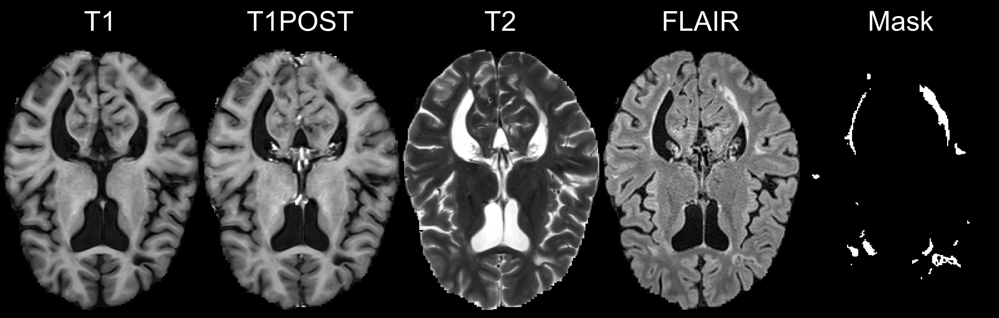
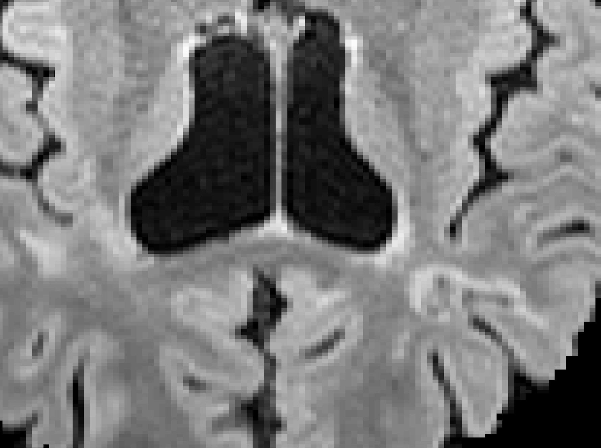

## Overview of Work/Research

- Segmentation/Classification of:
    - White Matter Lesions in Multiple Sclerosis
    - Brain vs. Skull (CT)
    - Brain Hemorrhage/Stroke (CT) 
- R Package Development/"Data Science"
- Neuroimaging and R (Neuroconductor Project)

## Overview of Work/Research

- Segmentation/Classification of:
    - **White Matter Lesions in Multiple Sclerosis**
    - Brain vs. Skull (CT)
    - Brain Hemorrhage/Stroke (CT) 
- R Package Development
- Neuroimaging and R (Neuroconductor Project)

# Lesion Segmentation of MS

## Public Dataset with Lesion Segmentation

* "A novel public MR image dataset of multiple sclerosis patients with lesion segmentations based on multi-rater consensus" [@msdata]
  - Data Published at http://lit.fe.uni-lj.si/tools.php?lang=eng
  - 30 subjects with MRI (3T Siemens Trio)
  - Manually segmented by 3 expert raters 
  - Creative-Commons Attribution (CC-BY)
  
## Demographic Data

Variable                       Overall       
-----------------------------  --------------
n                              30            
Age (mean (sd))                39.27 (10.12) 
EDSS (mean (sd))               2.61 (1.88)   
Lesion_Volume (mean (sd))      17.40 (16.13) 
MS_Subtype (%)                               
Clinically Isolated Syndrome   2 (6.7)       
Progressive-relapsing          1 (3.3)       
Relapsing-remitting            24 (80.0)     
Secondary-progressive          2 (6.7)       
Unspecified                    1 (3.3)       
sex = M (%)                    7 (23.3)      

- On many different therapies (9 no therapy)
- Relatively young (so WML not likely due to aging)

## Imaging Data

* 2D T1 (TR=2000ms, TE=20ms, TI=800ms) and after gadolinium
* 2D T2 (TR=6000ms, TE=120ms), 3D FLAIR (TR=5000ms, TE=392ms, TI=1800 ms)
    - Fluid attenuated inversion recovery - reduce signal of fluids
- All had flip angle of 120$^{\circ}$

<!-- The obtained median DSC values were 0.85 and 0.82 for -->
<!-- intra- and inter-rater variability using manual tools, while -->
<!-- the respective values obtained with the semi-automated -->
<!-- tools were 0.92 and 0.89. -->

## Terminology: Neuroimaging to Data/Statistics

* Segmentation ⇔ classification 
* Image ⇔ 3-dimensional array
* Mask/Region of Interest ⇔ binary (0/1) image 
* Registration ⇔  Spatial Normalization/Standarization
    - "Lining up" Brains

# An Image Processing Pipeline in R

## Image Representation: voxels (3D pixels)

 

## Step 1: Create Predictors for each Sequence   

## Data Structure for One Patient     

---

 

 
  <h2>Step 2: Aggregate Data</h2>
  Training Data Structure
  
  * Stack together 15 randomly selected patients
  * Train model/classifier on this design matrix
  
  
    
  

    
  
 

## Step 3: Fit Models / Classifier

Let $y_{i}(v)$ be the presence / absence of ICH for voxel $v$ from person $i$.  

General model form: 
$$
 P(Y_{i}(v) = 1)  \propto f(X_{i}(v))
$$

## Models Fit on the Training Data

- Logistic Regression: \(f(X_{i}(v)) = \text{expit} \left\{ \beta_0 + \sum_{k= 1}^{p} x_{i, k}(v)\beta_{k}\right\}  \)
- Random Forests [@ranger, @breiman2001random]

\(f(X_{i}(v)) \propto\) 

## Predicted Volume Estimates True Volume 

## Predicted Volume Estimates True Volume 

## Patient with Median Overlap in Validation Set

 

## R Package

- `smri.process` - on GitHub and Neuroconductor
  - relies on other Neuroconductor (not CRAN) packages
  - 

## Conclusions of Stroke Analyses

- We can segment ICH volume from CT scans   
- We can create population-level ICH distributions   
- Voxel-wise regression can show regions associated with severity   

## Conclusions of Stroke Analyses

- We can segment ICH volume from CT scans
    - **Incorporate variability of estimated volume**
- We can create population-level ICH distributions
    - **Uncertainty measures of this**
- Voxel-wise regression can show regions associated with severity
    - **Validate these regions (MISTIE III)**
    - **Scalar on image regression** 

# Neuroimaging and R

## Authored R Packages:

- **fslr** 
(Muschelli, John, et al. "fslr: Connecting the FSL Software with R." R JOURNAL 7.1 (2015): 163-175.)

- brainR 
(Muschelli, John, Elizabeth Sweeney, and Ciprian Crainiceanu. "brainR: Interactive 3 and 4D Images of High Resolution Neuroimage Data." R JOURNAL 6.1 (2014): 42-48.)

- extrantsr
- ichseg 
Muschelli, John, et al. "PItcHPERFeCT: Primary intracranial hemorrhage probability estimation using random forests on CT." NeuroImage: Clinical 14 (2017): 379-390.

- dcm2niir
- matlabr
- spm12r

- itksnapr
- papayar
- WhiteStripe
- oasis
- SuBLIME
- googleCite
- diffr
- rscopus
- glassdoor

## Number of Downloads (CRAN packages)

From the `cranlogs` R package:

<!--html_preserve-->

<!--/html_preserve-->

# Thank You
